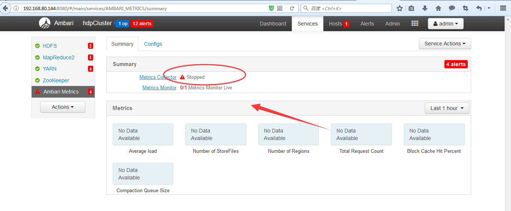
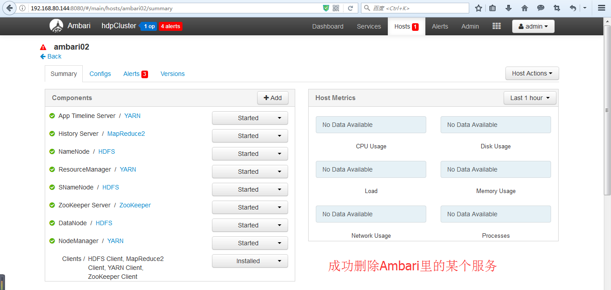

# ambri服务卸载
&emsp;&emsp;Ambari 借鉴了很多成熟分布式软件的 API 设计。Rest API 就是一个很好地体现。通过 Ambari 的 Rest API，可以在脚本中通过 curl 维护整个集群。并且，我们可以用 Rest API 实现一些无法在 Ambari GUI 上面做的操作。

&emsp;&emsp;目前 Ambari 不支持在 GUI 上面卸载已安装的 Service。所以当一个 Service 不再需要的时候，用户没法删除掉该 Service。幸运的是 Ambari 提供了 DELETE 的 Rest API，我们可以通过该 API 来删除 Ambari 中 Service。不过这里需要注意，这个方法只是从 Ambari Service 中删除了 Service。这样一来，Ambari 的 GUI 界面中不再显示这个 Service。但是 Service 本身还安装在 Agent 所在的机器。如果用户需要彻底的清除掉这个 Service，仍需要手工的到每个机器卸载（例如，在每个机器执行 yum erase）。

## 文档以Ambari中的`Ambari Metrics`服务为例
****



## 解决步骤
### 步骤一：查看日志
```
# 可以跳过，只是查看ambari-metrics-collector的日志
tail -f /var/log/ambari-metrics-collector/ambari-metrics-collector.log

# 可以跳过，只是查看ambari-metrics-monitor的日志
tail -f /var/log/ambari-metrics-monitor/ambari-metrics-monitor.log  
```

### 步骤二：停止`Ambari Metrics`服务

<font color=red>注意： 若是这步，关不掉Ambari  Metrics没事，可以使用步骤四！</font>

### 步骤三：杀死所有`Ambari Metrics`进程
* 查看服务状态
```
$ ambari-metrics-collector status
AMS is running as process 32767.

$ ambari-metrics-monitor status
psutil build directory is not empty, continuing...
Found ambari-metrics-monitor PID: 1037
ambari-metrics-monitor running.
Monitor PID at: /var/run/ambari-metrics-monitor/ambari-metrics-monitor.pid
Monitor out at: /var/log/ambari-metrics-monitor/ambari-metrics-monitor.out
```

* 杀死服务方式一
```
ambari-metrics-monitor stop
ambari-metrics-collector stop
```

* 杀死服务方式二
```
kill -9 32767 
kill -9 1037
```


### 步骤四：停止服务
* 查看集群信息
```
访问地址: 
http://192.168.80.144:8080/api/v1/clusters

返回数据:
{
    "href": "http://192.168.80.144:8080/api/v1/clusters",
    "items": [
        {
            "href": "http://172.16.96.166:8080/api/v1/clusters/cluster",
            "Clusters": {
                "cluster_name": "cluster"
            }
        }
    ]
}
```

* 查看服务信息
```
访问地址: 
http://192.168.80.144:8080/api/v1/clusters/cluster/services

返回数据:
{
    "href": "http://172.16.96.166:8080/api/v1/clusters/cluster/services",
    "items": [
        {
            "href": "http://172.16.96.166:8080/api/v1/clusters/cluster/services/AMBARI_METRICS",
            "ServiceInfo": {
                "cluster_name": "cluster",
                "service_name": "AMBARI_METRICS"
            }
        },
        {
            "href": "http://172.16.96.166:8080/api/v1/clusters/cluster/services/ZOOKEEPER",
            "ServiceInfo": {
                "cluster_name": "cluster",
                "service_name": "ZOOKEEPER"
            }
        }
    ]
}
```

* 停止服务
```
curl -u admin:admin -H "X-Requested-By: ambari" -X PUT -d '{"RequestInfo": {"context":"Stop Service"},"Body":{"ServiceInfo":{"state":"INSTALLED"}}}' http://192.168.80.144:8080/api/v1/clusters/cluster/services/AMBARI_METRICS
```
<font color="red">
注意:

192.168.80.144是我搭建ambari主服务的ip，你注意改为你自己的！

cluster是我集群的名字，你注意改为你自己的！

AMBARI_METRICS这里是停止该服务并要从ambari里删除它。
</font>


### 步骤五：杀死服务(快速立即执行)
```
curl -u admin:admin -H "X-Requested-By: ambari" -X DELETE http://192.168.80.144:8080/api/v1/clusters/cluster/services/AMBARI_METRICS
```

<font color="red">
注意:

192.168.80.144是我搭建ambari主服务的ip，你注意改为你自己的！

cluster是我集群的名字，你注意改为你自己的！

AMBARI_METRICS这里是停止该服务并要从ambari里删除它。
</font>

### 步骤六：刷新`Ambari UI`


<font color="red">
注意：

执行完成后，Ambari Metrics就从 Ambari 的 Service 里面删掉了，但是 Ambari Metrics的 package 还存在于机器。
</font>

### 步骤七：从机器卸载`Ambari Metrics`
```
rpm -qa | grep ambari_metrics
```

### 步骤八：从机器完全清除`Ambari Metrics`安装包
```
# 需要到各个 Agent 机器执行如下命令
# 如果要删除storm服务，则就是yum erase *strom*
yum erase *metrics*
# 命令执行完毕后，会显示删除了哪些安装包以及备份了哪些配置文件，为了保证完全清理相关文件，最好把备份的文件都删除掉。
```

<font color="green">
执行完后，这个 Ambari Metrics的Service 就被彻底的清除掉了！

OK，成功！Ambari里如何删除某指定的服务Ambari Metrics.

关于若是删除其他的服务，一样的步骤，把服务名改下就是了。
</font>

参考文档地址：  
https://www.cnblogs.com/zlslch/p/6653421.html