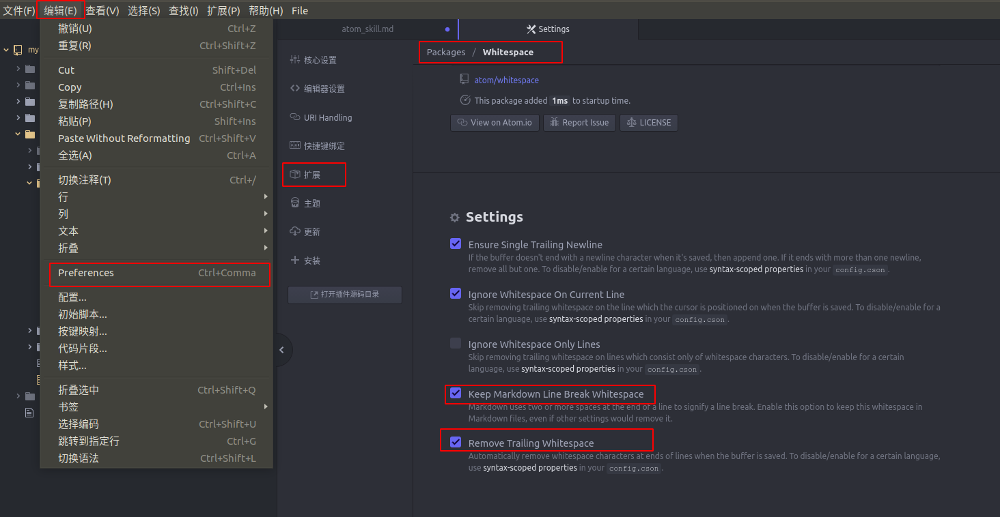
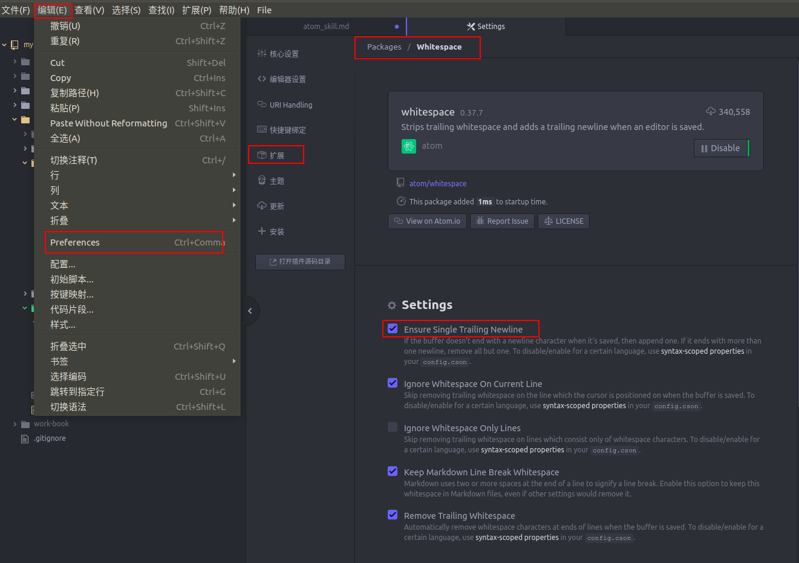

# Atom使用技巧
### Atom编辑Markdown文件保存后行尾的空格自动消失的问题解决
**解决方法1：**
【编辑】->【Preferences】->【扩展】->【搜索(whitespace)】->【设置】  
勾选掉：【Keep Markdown Line Break Whitespace】  
勾选掉：【Remove Trailing Whitespace】  
  
**解决方法2：**  
在解决方案1的基础上勾选掉：【Ensure single Trailing Newline】  
  
**解决方案3：**  
如果上面的方法都不管用的话，可以看看自己有没有装editorconfig这个package，如果有装的话，把Auto Indent这个选项取消勾选应该就可以解决。
