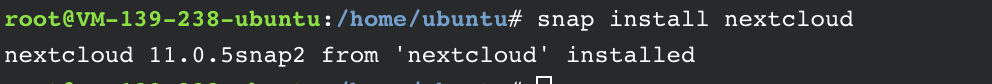

# 基于 Ubuntu + nextCloud 搭建自己的私人网盘
提醒一下，如果之前通过apache搭建了网站，不要用snap命令来搭建，否则，至少有一个无法正常运行。  

你可以通过[腾讯云的实验主机](https://cloud.tencent.com/developer/labs/lab/10287)进行尝试。  

## 1、基础设置
**切换为 root 账号**

Ubutu 系统默认登录的用户为非 root 权限用户，为了能正常安装 nextCloud，需要切换为 root 账号。执行如下命令即可：  
```shell
sudo su
```
**更新及安装基础包**  
```shell
apt-get update
apt-get install snap
apt-get install snapd
```
## 2、安装 nextCloud  
运行如下命令：  
```shell
snap install nextcloud
```
国内网络下载有点慢，需要耐心等待，差不多40分钟才安装好  

看到如下图则证明安装成功。  



## 3、设置 nextCloud
**创建用户**  
访问本机ip (http://<您的 IP 地址>/) 即可进入 nextCloud 的安装页面。  
第一次访问, 会提示你设置下管理员的帐号和密码  
**启用 SSL**  

这样就能使用 HTTPS 访问。执行如下命令，系统就会自动申请 Let's Encrypt 证书并启用   
```shell
sudo nextcloud.enable-https lets-encrypt
```
**以后升级**  
```shell
sudo snap refresh nextcloud
```
## 4、关于数据备份
数据库文件夹位置: /var/snap/nextcloud/current/   
数据库文件夹包含了:  
```txt
Apache, PHP, MySQL, and Redis logs
Keys and certificates
MySQL database
Redis database
Nextcloud config
Any Nextcloud apps installed by the user
```
文件保存的文件夹位置: /var/snap/nextcloud/common/   
文件夹包含了:  
```txt
Nextcloud data
Nextcloud logs
```
把数据库和文件的文件夹都备份就可以啦~  

 
**参考链接**  
 1、https://cloud.tencent.com/developer/labs/lab/10287  
 2、https://sphard.com/ebooks/nextcloud/nextcloud-snap.html 
