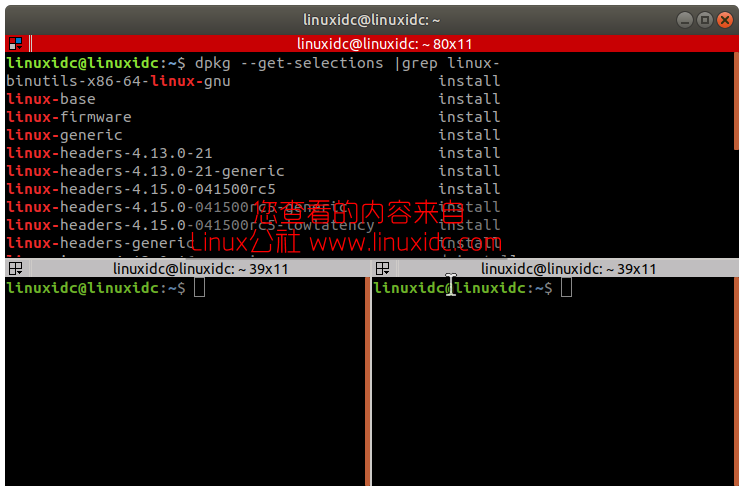
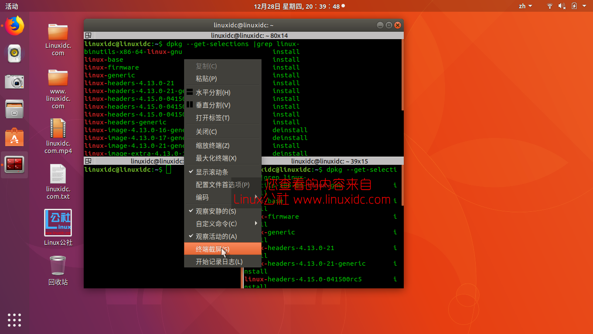
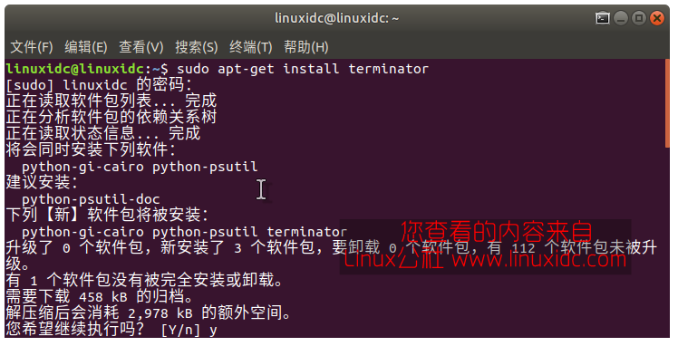
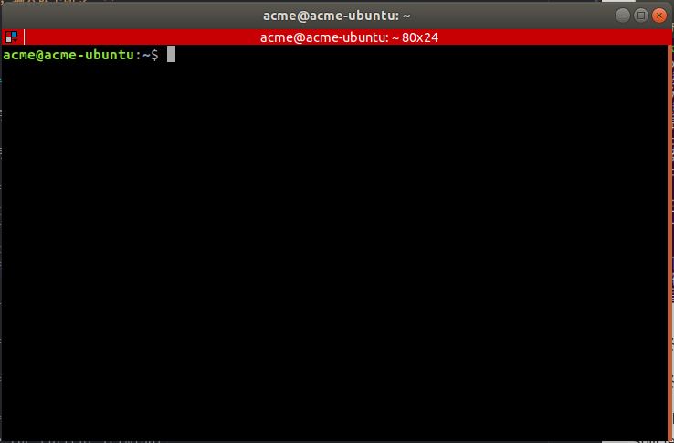
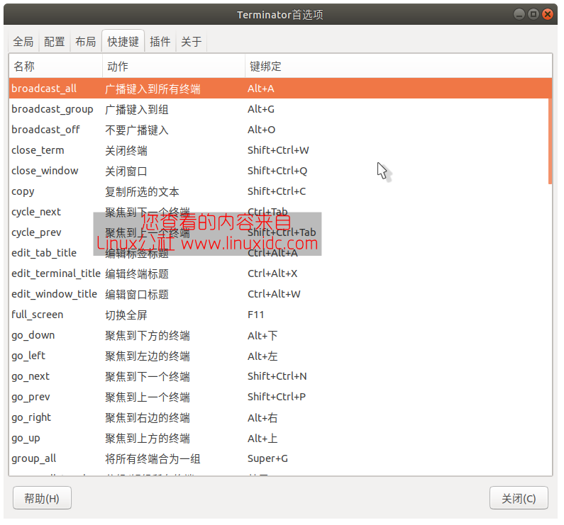
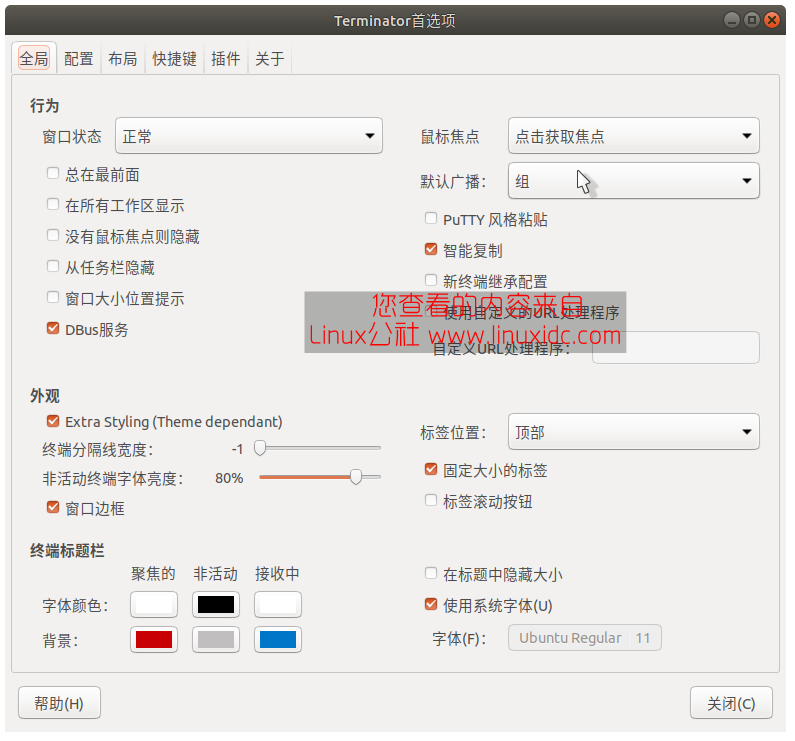
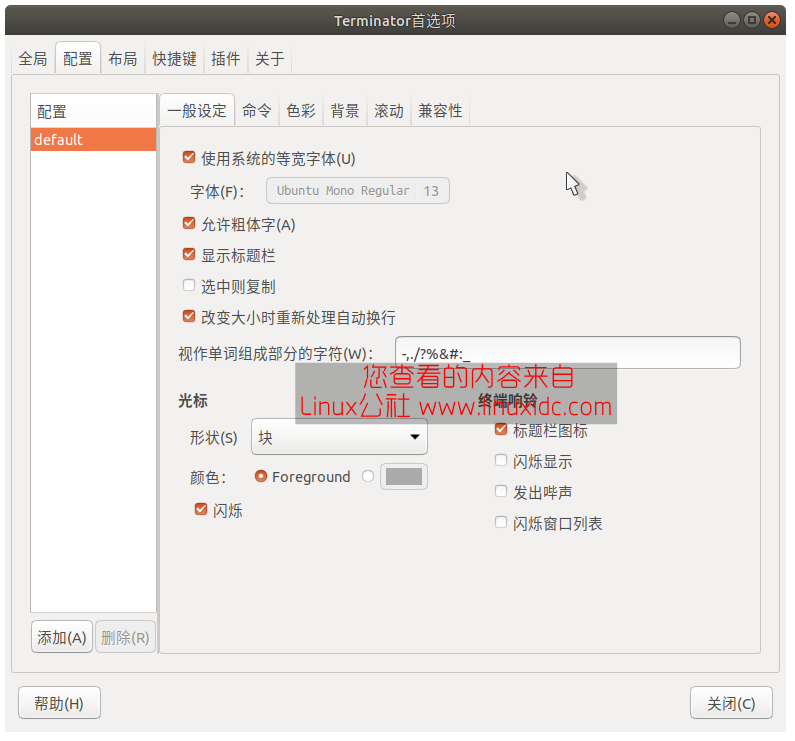
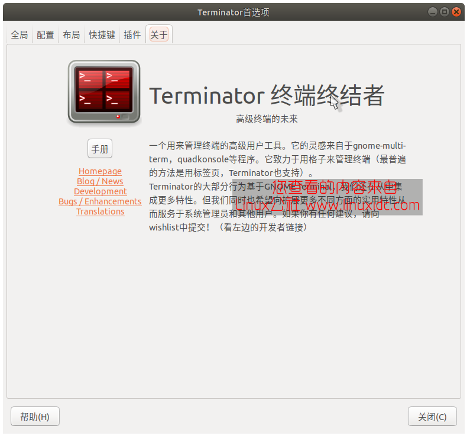

# Terminator终端终结者
&ensp;&ensp;本文所指的Terminator不是Ubuntu默认自带的命令行终端，而是GNOME图形化界面下的gnome-terminal，现在我们就来看一下Ubuntu上安装GNOME命令行终端Terminator的教程。



**目的：**
&ensp;&ensp;可以将终端分屏，这样我们在练习程序和编写或者对比文件的时候非常有用。
&ensp;&ensp;对Linux系统进行管理时，我们经常需要通过终端窗口输入各种操作命令。在GNOME集成桌面环境下，GNOME终端(gnome-terminal)是我们经常使用的终端程序，每次运行该程序都将打开一个单独的终端窗口。当我们进行命令行操作时，有时需要打开多个终端窗口，并且希望这些窗口能同时平铺显示，那该怎么办呢?其实，借助一款小巧而实用的软件——Terminator就可以轻松实现这一功能。
&ensp;&ensp;使用Terminator可以在一个窗口中显示多个GNOME终端窗口，并且可以按照用户的要求对窗口进行任意分割。
### 安装terminator
**打开终端，输入以下命令：**
```shell
sudo apt-get install terminator
```


**安装终端程序terminator，安装完毕后按ctrl+alt+t打开终端如下图所示**


**这个终端程序可以分屏，常用操作快捷键如下：**
```txt
//第一部份：关于在同一个标签内的操作
Alt+Up                          //移动到上面的终端
Alt+Down                        //移动到下面的终端
Alt+Left                        //移动到左边的终端
Alt+Right                       //移动到右边的终端
Ctrl+Shift+O                    //水平分割终端
Ctrl+Shift+E                    //垂直分割终端
Ctrl+Shift+Right                //在垂直分割的终端中将分割条向右移动
Ctrl+Shift+Left                 //在垂直分割的终端中将分割条向左移动
Ctrl+Shift+Up                   //在水平分割的终端中将分割条向上移动
Ctrl+Shift+Down                 //在水平分割的终端中将分割条向下移动
Ctrl+Shift+S                    //隐藏/显示滚动条
Ctrl+Shift+F                    //搜索
Ctrl+Shift+C                    //复制选中的内容到剪贴板
Ctrl+Shift+V                    //粘贴剪贴板的内容到此处
Ctrl+Shift+W                    //关闭当前终端
Ctrl+Shift+Q                    //退出当前窗口，当前窗口的所有终端都将被关闭
Ctrl+Shift+X                    //最大化显示当前终端
Ctrl+Shift+Z                    //最大化显示当前终端并使字体放大
Ctrl+Shift+N or Ctrl+Tab        //移动到下一个终端
Ctrl+Shift+P or Ctrl+Shift+Tab  //Crtl+Shift+Tab 移动到之前的一个终端

//第二部份：有关各个标签之间的操作
F11                             //全屏开关
Ctrl+Shift+T                    //打开一个新的标签
Ctrl+PageDown                   //移动到下一个标签
Ctrl+PageUp                     //移动到上一个标签
Ctrl+Shift+PageDown             //将当前标签与其后一个标签交换位置
Ctrl+Shift+PageUp               //将当前标签与其前一个标签交换位置
Ctrl+Plus (+)                   //增大字体
Ctrl+Minus (-)                  //减小字体
Ctrl+Zero (0)                   //恢复字体到原始大小
Ctrl+Shift+R                    //重置终端状态
Ctrl+Shift+G                    //重置终端状态并clear屏幕
Super+g                         //绑定所有的终端，以便向一个输入能够输入到所有的终端
Super+Shift+G                   //解除绑定
Super+t                         //绑定当前标签的所有终端，向一个终端输入的内容会自动输入到其他终端
Super+Shift+T                   //解除绑定
Ctrl+Shift+I                    //打开一个窗口，新窗口与原来的窗口使用同一个进程
Super+i                         //打开一个新窗口，新窗口与原来的窗口使用不同的进程
```
更多截图：




